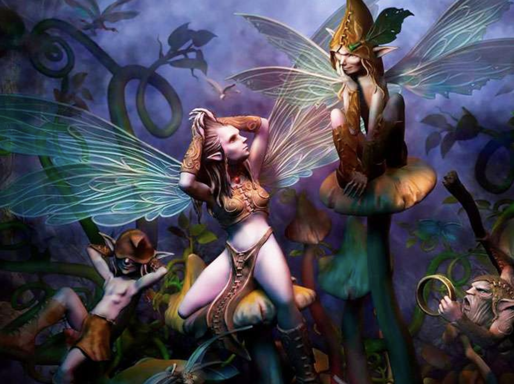

# Bosque Encantado

Los duendes y las hadas son criaturas mágicas que viven ocultos en un lugar muy secreto llamado **Parque Encantado**. 

Se nos solicita modelar un sistema de objetos que pueda incluir tanto a las criaturas conocidas como a cualquier otra que habite en el parque.

## Criaturas

Existen dos tipos de criaturas: los **duendes**, que pertenecen al Reino del Bosque, y las **hadas**, que forman parte del Reino de los Cielos. Sin embargo, podrían existir otras criaturas mágicas que aún desconocemos.

 De cada criatura nos interesa saber su poder mágico, su astucia y su rol en el parque. Y en particular en las hadas nos intersa saber cuantos kilometros puede volar. Cuando nacen todas las hadas pueden volar 2 kilometros y con el tiempo pueder ir aumentando paulatinamente la cantidad de kilometros hasta una máximo de 25.

 Los roles disponibles actualmente son guardián, domador o hechicero. Cada criatura tiene un único rol. 
 
 Los domadores pueden tener mascotas mitológicas que lograron entrenar, y de cada conoce su edad y si tiene o no cuernos.

 
 ### Poder Ofesivo de las Criaturas
Obtener el poder ofensivo de una criatura, el cual se calcula como su poder mágico multiplicado por 10 más un cierto extra que depende del rol:

- Guardián: Siempre recibe un extra de 100.
- Hechicero: No recibe ningún extra. 
- Domador: Recibe un extra de 150 unidades por cada mascota mitólogica que tiene cuernos.

Además, en el caso particular de los duendes, por su conexión innata con la naturaleza, su poder ofensivo aumenta en un 10%.

### Criaturas Formidables
Saber si una criatura es formidable. Esto ocurre si es astuta o si es extraordinaria. 

Un hada se considera astuta si su astucia es mayor a 50. Los duendes nunca son astutos. 

Saber si una criatura es extraorinaria depende de que el rol para la criatura sea extraordinario
- Guardián: Es extraordinario si el poder mágico de la criatura es mayor a 50.
- Domador: Es extraorinario si el poder mágico de la criatura es mayor o igual a 15, y si todas sus mascotas mágicas son veteranas. Una mascota mágica es veterana cuando su edad es de al menos 10 años.
- Hechicero: Siempre es extraordinario.

Además de tener un rol extraordinario las Hada necesitan una condicion adicional que puedan volar mas de 10 kilometros.

### Ritual de Cambio de Rol

Sabemos que cada criatura tiene un único rol, pero si se sienten aburridas pueden cambiarlo. El ritual consisete en pasar de un rol a otro tenniendo en cuenta las siguientes consideraciones.
- Si actualmente tiene el rol guardián unicamente puede pasar a rol domador con una nueva mascota mítologica de 1 año de edad y sin cuernos.
- Si tiene el rol hechicero solo puede pasar al rol guardían.
- Si tiene el rol domador puede pasar a Hechizero si tiene al menos una mascota magica con cuernos y en caso contarario se produce un error en el ritual que lo cancela.

## Colonias, areas y conquistas

Las criaturas se agrupan en colonias, y una colonia suele habitar un área del parque. Las áreas donde las colonias suelen vivir son: por un lado, **los claros**, zonas abiertas pero acogedoras, y por otro, **los castillos**.

Una colonia puede intentar conquistar un área del parque. Cuando esto sucede, la colonia atacante lucha contra la colonia actual que habita el área.

El poder ofensivo de la colonia atacante es igual a la suma del poder ofensivo que tiene cada criatura que pertenece a la colonia.

El poder defensivo de un área depende del tipo de área:

- Por estar rodeado de grandes murallas y fosos de agua, el poder defensivo de un castillo es igual a 200 unidades por cada criatura formidable de la colonia que lo habita.
- Y por estar en una zona abierta donde la batalla se realiza cuerpo a cuerpo, el poder defensivo de un claro es 100 unidades adicionales al poder ofensivo de la colonia que lo habita.

Si el poder ofensivo de la colonia invasora supera al poder defensivo del área, el área es usurpada por la colonia invasora, es decir, comienza a habitarla. 

Y si, en cambio, el área resultara vencedora, la conquista no tiene éxito; la colonia defensora mantiene el control, y todos los integrantes de la colonia invasora pierden el 15% de su poder mágico.

